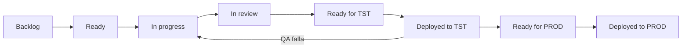

# Workflow de Desarrollo

Este documento define el **workflow oficial del equipo**.
Aplica a todos los repositorios.

Ambientes:
- **TST**
- **PROD**

Deploy: **manual**

---

## Vista general del flujo de estados

---

## 1. Principios

- Todo trabajo comienza con un **Issue**
- Todo cambio que llega a producción es **trazable**
- Se prioriza simplicidad y claridad sobre burocracia

---

## 2. Issues

Un **Issue representa una unidad de trabajo**:
- bug
- feature
- chore (tarea técnica)

Regla:
> **Si no hay Issue, el trabajo no existe.**

Los Issues se crean usando **Issue Forms (.yml)**.

Cada Issue debe:
- tener tipo, prioridad y área
- estar asignado a un Milestone
- estar agregado al Project

---

## 3. Modelo de ramas

main  → PROD  
dev   → TST (integración)

- Las ramas de trabajo salen **siempre desde `dev`**
- Convención de nombres:
  - `feature/ID-descripcion`
  - `bugfix/ID-descripcion`
  - `chore/ID-descripcion`

Responsabilidades:
- `main` y `dev` son gestionadas por el responsable de integración
- Los desarrolladores trabajan por ticket en ramas propias

---

## 4. Política de commits

Durante el desarrollo de un ticket:
- Se recomiendan **commits pequeños y frecuentes**
- Se permite marcar commits como **WIP (Work In Progress)**

Ejemplo durante el desarrollo:
feat(123): agregar validaciones de entrada (WIP)

Al integrar el ticket a `dev`:
- El ticket debe quedar como **1 solo commit final** (squash)
- El commit final **no debe contener `(WIP)`**

Ejemplo de commit final:
feat(123): agregar validaciones de entrada

Tipos permitidos:
- `feat` – nueva funcionalidad
- `fix` – corrección de bug
- `chore` – tarea técnica

---

## 5. Integración de tickets

1. El desarrollador finaliza el trabajo en su rama
2. Realiza rebase contra `dev`
3. Se integra a `dev` (PR liviano o merge por el responsable)
4. Se elimina la rama del ticket

---

## 6. Flujo TST y QA

1. El código está integrado en `dev`
2. Se ejecuta deploy manual a **TST**
3. El Issue pasa a estado **Deployed to TST**
4. **QA / validación funcional se realiza en este estado**

Si QA detecta errores:
- El Issue **retrocede** a `In progress`
- Se corrige y vuelve a recorrer el flujo normal

No existe un estado separado "Testing".

---

## 7. Flujo PROD

1. El Issue validado en TST pasa a **Ready for PROD**
2. Se realiza PR de `dev` → `main`
3. Deploy manual a **PROD**
4. El Issue pasa a **Deployed to PROD**
5. Se cierra el Issue y el Milestone

---

## 8. Project (estados oficiales)

- Backlog
- Ready
- In progress
- In review
- Ready for TST
- Deployed to TST
- Ready for PROD
- Deployed to PROD

---

## 9. Reglas importantes

- Un Issue puede **retroceder de estado** si falla QA
- No se utiliza el estado **Reopened**
- Bugs detectados en PROD generan **un Issue nuevo**

---

## 10. Regla mental

Issue     = trabajo  
Project   = estado  
Milestone = entrega  

## 11. Automatización: auto-agregar Issues al Project

El Project **AFA – Development** agrega automáticamente los Issues nuevos al tablero.

> Nota: esto se configura **en el Project**, no en cada repositorio.

### Motivo técnico
GitHub limita la cantidad de workflows tipo **Auto-add to project**.  
Por eso se usa este patrón en 2 pasos:

### Workflow A — Auto-add to project
Ruta:
Project → AFA – Development → Workflows → Auto-add to project

Configuración recomendada:
- Filter:
  - `is:issue is:open`
- Action:
  - Add the item to the project

Este workflow **solo agrega** el Issue al Project.

### Workflow B — Item added to project (setea Status)
Ruta:
Project → AFA – Development → Workflows → Item added to project

Configuración recomendada:
- When:
  - When an item is added to the project
- Action:
  - Set field value:
    - Field: `Status`
    - Value: `Backlog`

Este workflow se usa para asignar automáticamente el estado inicial del Issue.

### Prueba
1. Crear un Issue en cualquier repositorio de la org
2. Verificar que aparece en el Project AFA – Development en la columna **Backlog**
Tag       = versión en PROD
